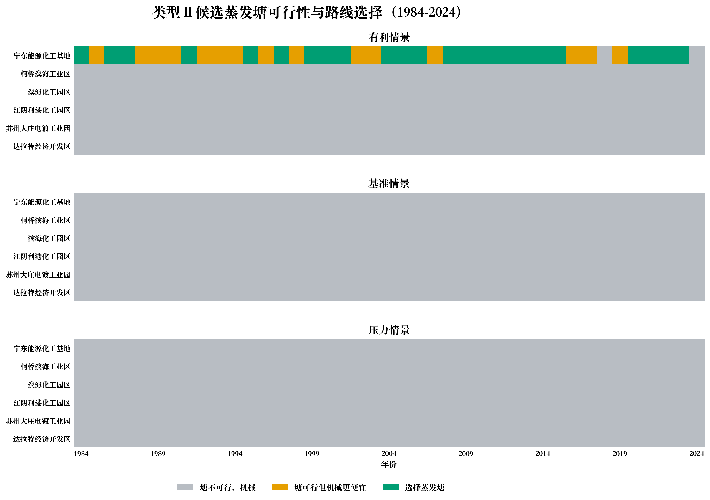

# 任务二精简成果包

本目录用于通过 GitHub 网页直接上传任务二的核心成果。目录内没有子文件夹，
可以在 Finder 中全选这些文件后拖入 GitHub 的 `Add file > Upload files` 页面。

## 保留内容

- 任务二计算书、工程估算报告和类型 I 净蒸发报告。
- 参数的单位、来源和置信度，以及输出字段字典。
- 2,486 座设施统一输入表。
- 1,481 个匹配站点的 NASA POWER 年度气候数据。
- 类型 I 2024 基准逐设施结果，共 2,486 条。
- 类型 I 历史全国汇总、类型 II 六候选完整逐年结果。
- 省级电网因子、质量检查、核算脚本和6张成果图。

## 未放入精简包

- 256 MB 类型 I 全历史逐设施结果。
- 35 MB PEV 与 NASA POWER 合并气候输入表。
- NASA POWER 原始 JSON 和3.4 GB原始逐日 PEV。

这些大文件仍保留在本地工程中。精简包适合展示、汇报和结果复核，
不等同于完整数据归档。

## 重要口径

类型 I 是2,486座污水处理设施的工程估算。类型 II 仅为6个工业园区
合成候选情景，不是全国统计，也不是设施实测。成本、盐度、浓盐水量、
土地和机械能耗等参数仍含估算假设。

## 图表

## GitHub网页限制

GitHub网页上传单个文件上限为25 MiB，一次最多100个文件：
https://docs.github.com/en/repositories/working-with-files/managing-files/adding-a-file-to-a-repository
本目录已按该限制检查。
