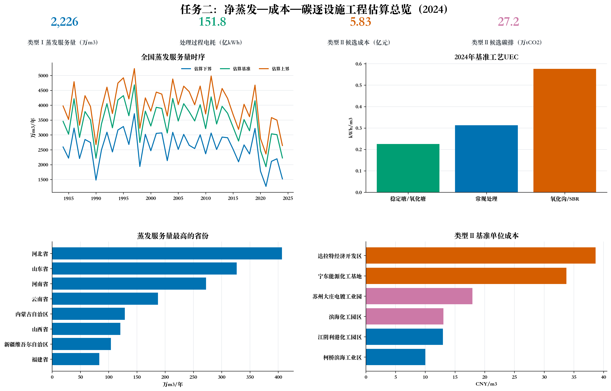

# Evaporation-to-Electricity Transition

任务二：净蒸发、成本与碳排放的逐设施工程估算。

> **最新研究进展，更新于 2026-07-03**
>
> 任务二 **V1 工程估算版** 已完成：统一设施输入、气候匹配、类型 I
> 净蒸发与过程用能核算、类型 II 六候选处置情景、质量检查和可视化。
> 当前成果可用于阶段汇报和方法审查，尚不是实测终版。
>
> [查看最新成果清单、完成状态与下一步](LATEST_PROGRESS.md)

本仓库研究自然蒸发能力变化如何影响污水处理设施和高盐工业废水终端的
水量消纳、能源需求、成本与碳排放。当前版本实现了任务书二的核算框架，
用于方法验证和工程情景比较，不代表逐厂实测结果。

## 核算对象

- **类型 I**：2,486 座中国污水处理设施，覆盖 1984-2024 年。
- **类型 II**：6 个工业园区合成候选案例，覆盖 1984-2024 年。
- **气候数据**：1,481 个匹配站点的 NASA POWER 年度数据。
- **情景设置**：类型 I 为下界、基准、上界；类型 II 为有利、基准、压力。

类型 II 的浓盐水量、TDS、回收率和可用土地均为工程估算，因此不能外推为
全国统计，也不能表述为园区现状。

## 2024 基准结果

| 指标 | 估算结果 |
|---|---:|
| 类型 I 自然蒸发服务量 | 2,225.7 万 m3/年 |
| 类型 I 机械替代影子用电 | 4.451 亿 kWh/年 |
| 类型 I 机械替代影子碳排 | 24.63 万 tCO2/年 |
| 类型 I 污水处理过程用电 | 151.83 亿 kWh/年 |
| 类型 II 六候选浓盐水量 | 2,854.7 万 m3/年 |
| 类型 II 六候选处置成本 | 5.835 亿元/年 |
| 类型 II 六候选处置碳排 | 27.22 万 tCO2/年 |

“机械替代影子值”用于衡量自然蒸发服务的技术替代量，不是设施真实支出或
已经实现的节能减排。类型 I 过程用电、类型 I 影子账目和类型 II 终端处置
账目口径不同，不可直接相加。



## 核心公式

```text
E_net = Kp * PEV * f_sal - P
V_service = A_exp * max(E_net, 0)

A_pond = Q_brine / E_net
c_pond = annualized_CAPEX / E_net + pumping_cost
c_mechanical = SEC_mechanical * electricity_price + nonenergy_cost
```

类型 II 仅在蒸发塘满足气候、面积和土地阈值且成本更低时选择蒸发塘；
其余情况选择机械浓缩代理路线。

## 仓库内容

最新成果的版本、范围和成熟度统一记录在
[LATEST_PROGRESS.md](LATEST_PROGRESS.md)。以下目录只保留当前研究需要的
核心文件。

### 方法文档

- [任务二计算书](docs/task2_calculation_book.pdf)
- [工程估算核算报告](docs/task2_accounting_report.md)

### 输入与元数据

- [设施统一输入表](data/facility_input_v1.csv)
- [NASA POWER 站点年度气候数据](data/station_year_climate_nasa_power_v1.csv)
- [参数、单位、来源与置信度](data/estimated_parameter_table_v1.csv)
- [输出字段字典](data/estimated_output_dictionary_v1.csv)
- [核算质量检查](data/quality_summary_v1.csv)
- [2023 年省级电网排放因子](data/province_grid_emission_factor_2023.csv)

### 关键结果

- [类型 I 2024 基准逐设施结果](results/type_i_facility_2024_base_v1.csv)
- [类型 I 全国年度汇总](results/type_i_national_year_summary_v1.csv)
- [类型 I 2024 工艺分组汇总](results/type_i_process_group_summary_2024_v1.csv)
- [类型 II 六候选估算输入](results/type_ii_estimated_input_v1.csv)
- [类型 II 六候选逐年结果](results/type_ii_facility_year_estimated_disposal_v1.csv)
- [类型 II 阈值变化摘要](results/type_ii_threshold_transition_summary_v1.csv)

### 代码与图表

- `scripts/`：核算与可视化方法脚本。
- `figures/`：6 张任务二成果图。

精简仓库未包含 256 MB 的类型 I 全历史逐设施表、35 MB 的合并气候输入、
NASA POWER 原始 JSON，以及 3.4 GB 的原始逐日 PEV。脚本作为方法记录保留；
完整端到端复算仍需这些本地上游数据。

## 主要限制

1. 类型 I 暴露水面主要来自模型估算，不是逐厂测量。
2. PEV 产品方法尚未完全公开，`Kp` 采用任务书给出的情景区间。
3. 类型 II 六个对象是低置信度合成案例，不是已核实浓盐水设施。
4. 机械路线采用 WaterTAP 思路的代理模型，不是正式 WaterTAP 求解。
5. 工艺碳排仅计电力，未计药剂、污泥和直接 CH4/N2O。
6. 2023 年电网因子被固定用于历史期，成本也没有统一价格年。

## 状态

当前版本为 **V1 工程估算版**。适合阶段汇报、方法审查和后续参数替换，
不适合直接用于投资报价、设施绩效评价或全国高盐废水总量判断。
